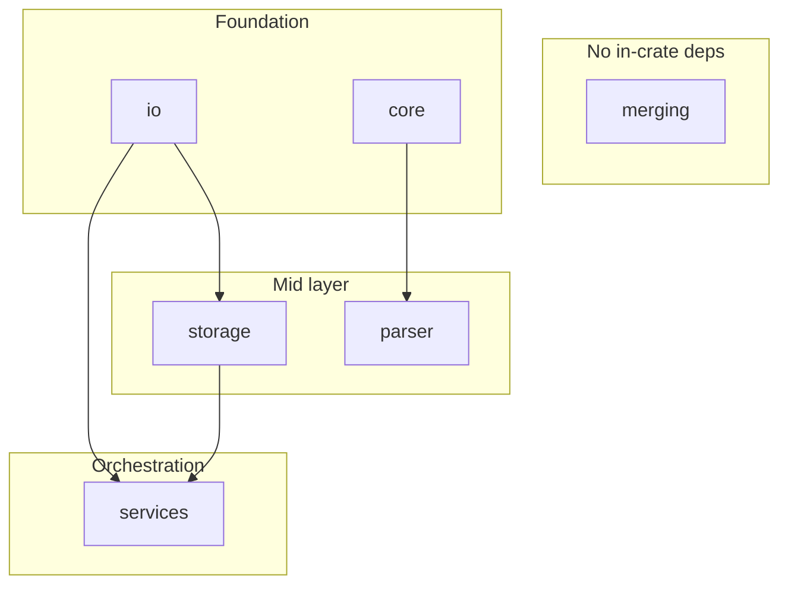
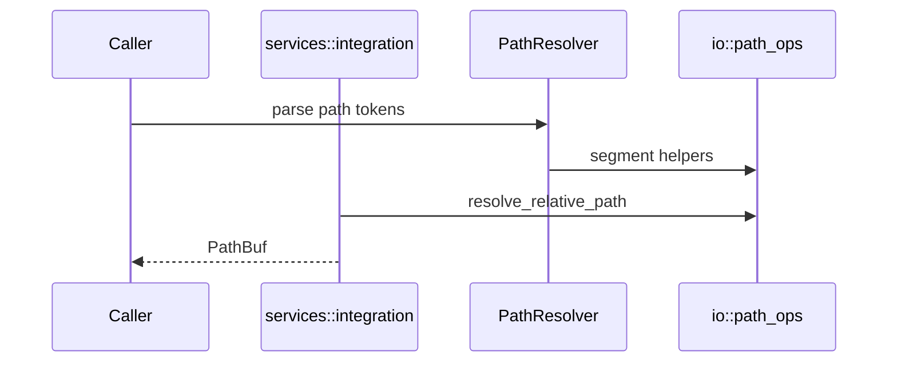
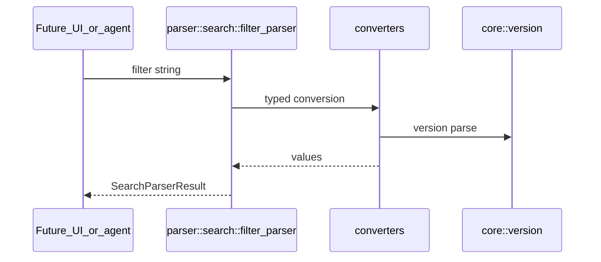

# Dependency diagrams

Module-level `crate::` dependencies in `src/` (approximate layering).

## Module dependencies

Notes:

- **parser** imports **core** only (among non-parser modules).
- **storage** imports **io**.
- **services** imports **io**; **storage** appears in integration tests and docs, not as a required `use` in every resolver file.
- **merging** is currently isolated until wired to a parser pipeline.

## Call flow (path resolution)

## Call flow (filter search)

