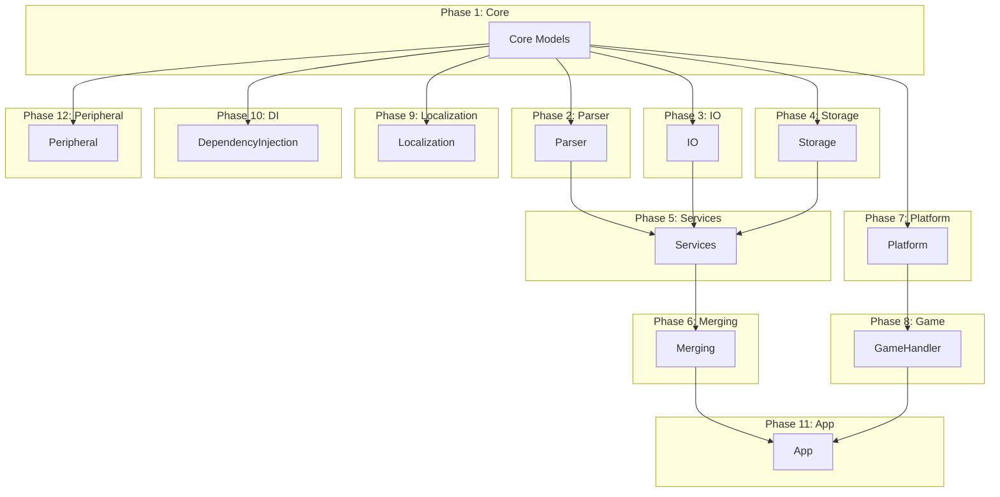

# IronyModManager Conversion Dependency Graph

Dependency order for incremental C#→Rust conversion. Convert parts in phase order; within a phase, parts can be converted in parallel if they share no dependencies.

## Part Dependencies

## Conversion Order

1. **core** — Common, Models.Common, Models, Shared (no dependencies)
2. **parser**, **io**, **storage**, **platform**, **localization**, **di**, **peripheral** — depend on core
3. **services** — depends on parser, io, storage
4. **merging** — depends on services
5. **game** — depends on platform
6. **app** — depends on merging, game, localization, di
